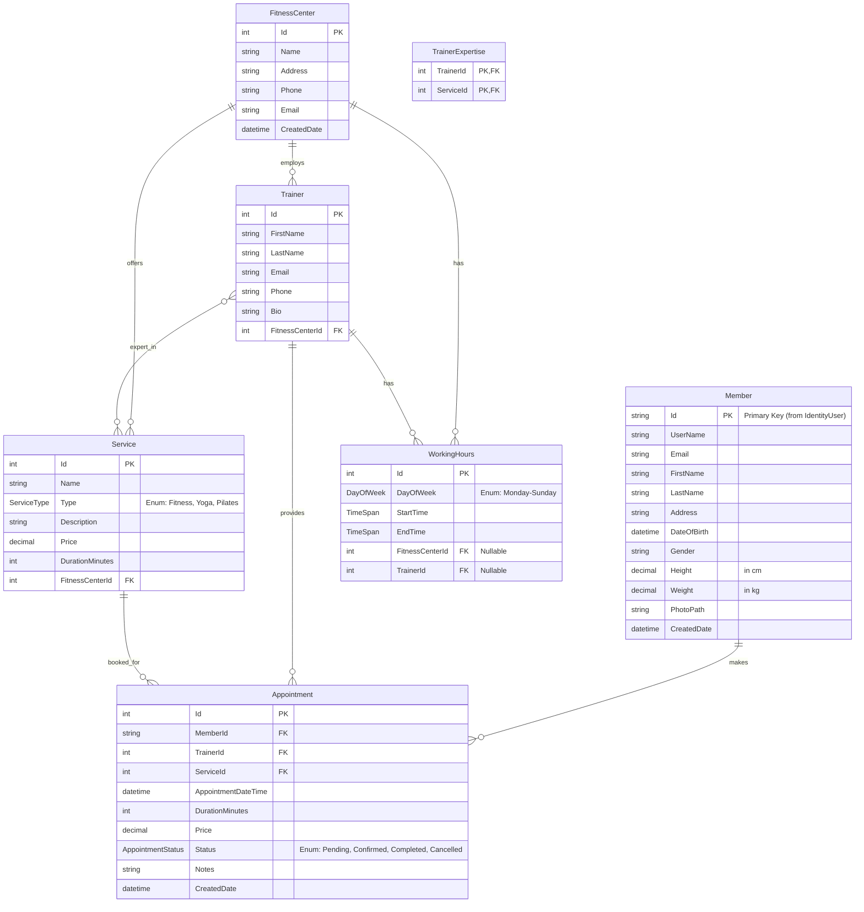

# Database Entity Relationship Model (ERM) Diagram
## Fitness Center Management System

### Mermaid ER Diagram

### Entity Descriptions

#### 1. Member
- **Description**: Represents users of the system (extends ASP.NET Core Identity User)
- **Primary Key**: Id (string, inherited from IdentityUser)
- **Key Attributes**:
  - Personal Information: FirstName, LastName, Address, DateOfBirth, Gender
  - Body Metrics: Height (cm), Weight (kg)
  - Profile: PhotoPath, CreatedDate
- **Relationships**:
  - One-to-Many with Appointment (a member can have multiple appointments)

#### 2. FitnessCenter
- **Description**: Represents physical fitness center locations
- **Primary Key**: Id (int)
- **Key Attributes**:
  - Name, Address, Phone, Email
  - CreatedDate
- **Relationships**:
  - One-to-Many with Trainer (a center employs multiple trainers)
  - One-to-Many with Service (a center offers multiple services)
  - One-to-Many with WorkingHours (a center has operating hours)

#### 3. Trainer
- **Description**: Represents fitness trainers working at fitness centers
- **Primary Key**: Id (int)
- **Key Attributes**:
  - FirstName, LastName, Email, Phone, Bio
  - FitnessCenterId (Foreign Key)
- **Relationships**:
  - Many-to-One with FitnessCenter (each trainer belongs to one center)
  - One-to-Many with Appointment (a trainer can have multiple appointments)
  - One-to-Many with WorkingHours (a trainer has working hours)
  - Many-to-Many with Service via TrainerExpertise (trainers can specialize in multiple services)

#### 4. Service
- **Description**: Represents services offered by fitness centers
- **Primary Key**: Id (int)
- **Key Attributes**:
  - Name, Type (Enum: Fitness, Yoga, Pilates), Description
  - Price (decimal), DurationMinutes (int)
  - FitnessCenterId (Foreign Key)
- **Relationships**:
  - Many-to-One with FitnessCenter (each service belongs to one center)
  - One-to-Many with Appointment (a service can be booked in multiple appointments)
  - Many-to-Many with Trainer via TrainerExpertise (services can be provided by multiple trainers)

#### 5. Appointment
- **Description**: Represents booking/appointment records
- **Primary Key**: Id (int)
- **Key Attributes**:
  - MemberId, TrainerId, ServiceId (Foreign Keys)
  - AppointmentDateTime, DurationMinutes, Price
  - Status (Enum: Pending, Confirmed, Completed, Cancelled)
  - Notes, CreatedDate
- **Relationships**:
  - Many-to-One with Member (each appointment belongs to one member)
  - Many-to-One with Trainer (each appointment is with one trainer)
  - Many-to-One with Service (each appointment is for one service)

#### 6. WorkingHours
- **Description**: Represents working/operating hours for fitness centers or trainers
- **Primary Key**: Id (int)
- **Key Attributes**:
  - DayOfWeek (Enum: Monday through Sunday)
  - StartTime, EndTime (TimeSpan)
  - FitnessCenterId (Nullable Foreign Key)
  - TrainerId (Nullable Foreign Key)
- **Relationships**:
  - Many-to-One with FitnessCenter (optional - center operating hours)
  - Many-to-One with Trainer (optional - trainer availability hours)
  - Note: Each WorkingHours record belongs to either a FitnessCenter OR a Trainer (not both)

#### 7. TrainerExpertise
- **Description**: Junction table for many-to-many relationship between Trainer and Service
- **Composite Primary Key**: (TrainerId, ServiceId)
- **Key Attributes**:
  - TrainerId (Foreign Key)
  - ServiceId (Foreign Key)
- **Relationships**:
  - Many-to-One with Trainer
  - Many-to-One with Service
  - Represents which trainers are qualified to provide which services

### Relationship Summary

| Relationship Type | From Entity | To Entity | Cardinality | Description |
|------------------|------------|-----------|--------------|-------------|
| One-to-Many | FitnessCenter | Trainer | 1:N | A fitness center employs multiple trainers |
| One-to-Many | FitnessCenter | Service | 1:N | A fitness center offers multiple services |
| One-to-Many | FitnessCenter | WorkingHours | 1:N | A fitness center has operating hours |
| One-to-Many | Trainer | Appointment | 1:N | A trainer can have multiple appointments |
| One-to-Many | Trainer | WorkingHours | 1:N | A trainer has availability hours |
| One-to-Many | Service | Appointment | 1:N | A service can be booked in multiple appointments |
| One-to-Many | Member | Appointment | 1:N | A member can make multiple appointments |
| Many-to-Many | Trainer | Service | M:N | Trainers can specialize in multiple services (via TrainerExpertise) |

### Database Constraints

1. **Foreign Key Constraints**:
   - Trainer.FitnessCenterId → FitnessCenter.Id (Cascade Delete)
   - Service.FitnessCenterId → FitnessCenter.Id (Cascade Delete)
   - Appointment.MemberId → Member.Id (Restrict Delete)
   - Appointment.TrainerId → Trainer.Id (Restrict Delete)
   - Appointment.ServiceId → Service.Id (Restrict Delete)
   - WorkingHours.FitnessCenterId → FitnessCenter.Id (Cascade Delete, Nullable)
   - WorkingHours.TrainerId → Trainer.Id (Cascade Delete, Nullable)
   - TrainerExpertise.TrainerId → Trainer.Id
   - TrainerExpertise.ServiceId → Service.Id

2. **Unique Constraints**:
   - Member.Email (via Identity)
   - TrainerExpertise composite key (TrainerId, ServiceId)

3. **Data Types**:
   - Decimal precision: Height, Weight (5,2), Price (18,2)
   - String lengths: Various max lengths for names, addresses, etc.
   - Enums: ServiceType, AppointmentStatus, DayOfWeek

### Notes

- **Member** extends ASP.NET Core Identity's `IdentityUser`, inheriting authentication and authorization properties
- **WorkingHours** can belong to either a FitnessCenter (general operating hours) or a Trainer (individual availability), but not both
- **TrainerExpertise** is a junction table enabling the many-to-many relationship between Trainers and Services
- Delete behaviors: Cascade for center-related entities, Restrict for appointment-related entities to prevent accidental data loss
